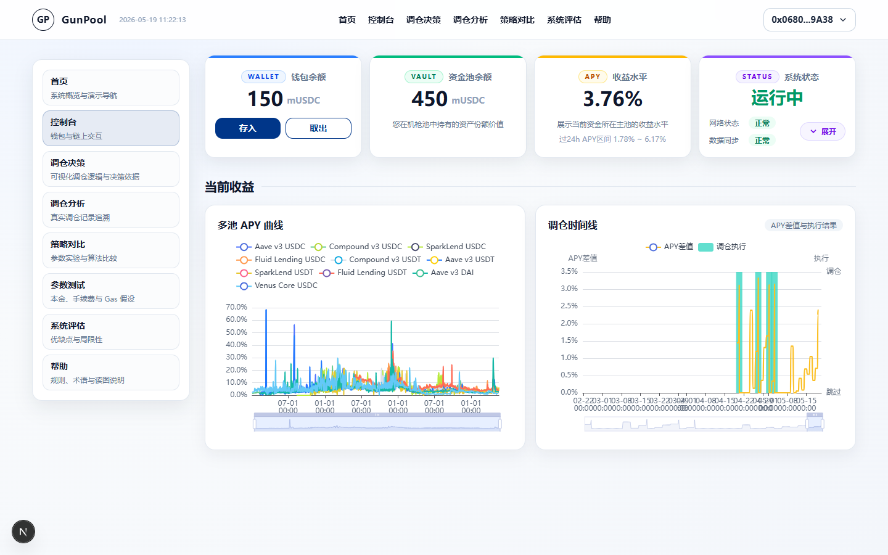
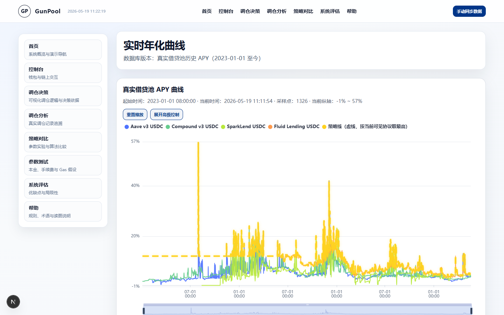
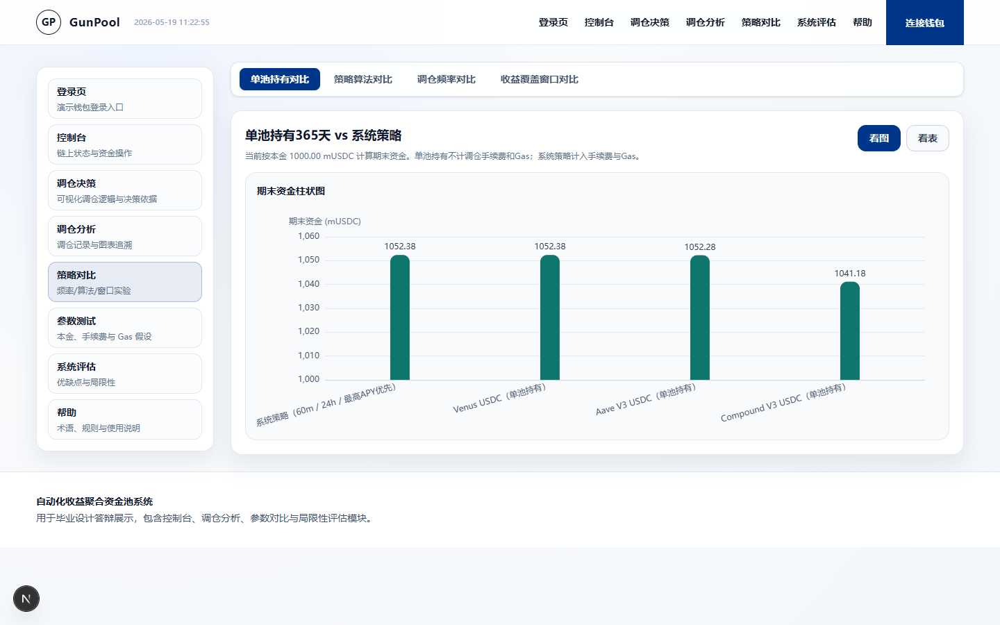

# GunPool

> **Research prototype (2026).**
> Please read [What is real and what is simulated](#what-is-real-and-what-is-simulated) and
> [Known limitations](#known-limitations) before drawing any conclusion from the numbers in the dashboard.

GunPool (机枪池, Chinese DeFi slang for a yield aggregator) asks one question about stablecoin yield:

**When is it worth moving deposits from one lending pool to a better-paying one, once the move itself has a cost?**

The project approaches it from four sides:

1. **Market data pipeline.** Historical APY of real stablecoin lending pools is pulled from DefiLlama and stored in SQLite.
2. **Cost-aware rebalancing rule.** Move funds only if the expected extra yield over a time window exceeds the fee.
   The rule is replayed hour by hour over the historical data (2023-01-01 to now).
3. **Strategy comparison.** A simulator compares strategies, rebalancing frequencies and yield windows
   (net gain, fees, number of rebalances, max drawdown, worst day, stability score).
4. **On-chain prototype and dashboard.** A `StrategyVault` with mock pools on a local chain, plus a Next.js dashboard.

## Screenshots

The dashboard text is in Chinese. Screenshots were captured in May 2026. The first one mixes real and simulated values
(see its caption); the other two show pages backed by real data.



*Console overview. The wallet and vault balances (150 / 450 mUSDC) and the wallet address are simulated demo values.
The multi-pool APY curves and the rebalance timeline are computed from the real APY history.*



*Historical APY of the lending pools stored in SQLite (from 2023-01-01), with a dashed "best available APY" line.*



*One-year comparison for a 1000 mUSDC principal: holding a single pool versus the rebalancing strategy
(60 min / 24 h / highest APY first). Single-pool holds pay no rebalance cost; the strategy includes fees and gas.
Computed by the simulator on the real APY history.*

## Data pipeline

- **Source:** DefiLlama yields chart API (`https://yields.llama.fi/chart/<pool id>`).
- **Pools:** 10 stablecoin lending pools (USDC, USDT, DAI) on Aave v3, Compound v3, SparkLend, Fluid Lending and Venus Core
  (full list in `gunpool-frontend/src/lib/market-pools.ts`).
- **History:** from 2023-01-01 00:00 UTC to now, stored in `gunpool-frontend/.local/market-data.sqlite`
  (tables: `market_pools`, `market_apy_points`, `market_fetch_runs`, `market_fetch_run_items`, `rebalance_decisions`).
- **Fetching:** retries with exponential backoff, request timeout, user-agent rotation and concurrent workers.
- **Access:** `GET/POST /api/market-apy` (POST forces a sync); the server also re-syncs if the data is older than 15 minutes.

```bash
# force a sync (frontend server must be running)
npm --prefix gunpool-frontend run sync:market
```

Environment variables for fetching: `APY_FETCH_RETRY` (default `4`), `APY_FETCH_TIMEOUT_MS` (default `12000`),
`APY_FETCH_CONCURRENCY` (default `3`).

## Rebalancing rule and strategy comparison

The decision replay lives in `computeRebalanceDecisions` (`gunpool-frontend/src/lib/server/market-sync.ts`).
For every hour since 2023-01-01:

```text
best      = pool with the highest current APY
delta     = best APY - APY of the pool currently held
gain      = assets x delta x window / 1 year
fee       = max(minFee, assets x feeRate)
rebalance = (best != held) AND (gain > fee)
```

- Each pool's APY is its most recent observation at or before that hour, so the rule never looks ahead.
- Assets then grow at the held pool's APY, compounded hourly, and the fee is deducted when a rebalance happens.
- Every decision and its reason (`rebalance_executed`, `gain_below_fee`, `already_best`) is stored in `rebalance_decisions`.
- Parameters (environment variables): `REBALANCE_FEE_RATE_BPS` (default `5`), `REBALANCE_FEE_MIN_USDC` (default `0`),
  `REBALANCE_WINDOW_SECONDS` (default 7 days), `STRATEGY_START_ASSETS` (default `1000`).

The `/strategy` page has a client-side simulator over a 365-day lookback. It compares three strategies (highest APY first,
ΔAPY ≥ 0.30% threshold, 6-hour smoothed APY), four rebalancing frequencies (10 / 30 / 60 / 120 min) and four yield windows
(12 / 24 / 48 / 96 h), with adjustable principal, fee rate, minimum fee and gas assumption.

The smart contract uses the same idea in simplified form: `StrategyVault.expectedGainIfRebalance` compares the expected gain
over `gainWindowSeconds` with a constant `gasCostAssets`.

## What is real and what is simulated

| Part | Status | Notes |
|---|---|---|
| DefiLlama APY history and SQLite storage | **Real** | Data from real lending pools, 2023-01-01 to now |
| Hourly rebalance-decision replay (`rebalance_decisions`) | **Computed on real data** | The portfolio is hypothetical: assumed principal and a simple fee model |
| `/apy` page | **Real data** | APY curves read from the database |
| `/strategy`: "single-pool hold vs system strategy" and the recommended-strategy card | **Computed** | Simulator run on the real APY history |
| `/strategy`: frequency, algorithm and window comparison tabs | **Hard-coded illustrative numbers** | Tables and charts use fixed values scaled by the principal. The simulator also computes these cases, but its results are not displayed there |
| Smart contracts and scripts (`deploy`, `admin:step`, `faucet`) | **Real, local chain only** | Mock pools on a local Ganache chain; `admin:step` really sends the rebalance transaction |
| `/console` wallet, deposit and withdraw | **Simulated** | Demo identity; balances live in browser localStorage. No transaction is sent, and the "success" messages refer to that simulated state |
| `/history` | **Entirely mock data** | Generated inside the page. The transaction hashes shown are fabricated |
| `/principle`, `/help`, `/analysis` | Static explanatory content | No live data |
| `/api/local-history` and `local-history.sqlite` | Implemented but unused | No page calls it |

In the current code the dashboard does not send transactions. Contract behaviour is exercised through the scripts, not through the UI.

## Known limitations

**Scope**

- Prototype only. Mock pools, no audit, no real funds. Nothing here is investment advice.
- The simulated dashboard parts listed above. The UI text is in Chinese.

**Contracts**

- `MockPool` APY is just a settable number. No yield accrues over time; vault NAV only changes through `simulateProfit`.
- `StrategyVault.allocated[]` tracks principal only. After `simulateProfit`, withdrawing everything reverts (arithmetic
  underflow), and `rebalance` moves principal only, leaving the profit in the old pool.
- `deposit` ignores the return values of `transferFrom` / `approve`, has no protection against first-depositor share
  inflation or donations, and has a single owner with no pause or ownership transfer.
- No automated tests.

**Backtest**

- The quoted APY is treated as the realised return and compounded hourly.
- The cost model is a percentage fee plus an assumed gas amount. There is no slippage, pool capacity, withdrawal limit,
  stablecoin depeg or protocol risk.
- One historical path, no train/test split. Strategy parameters (for example the 0.30% threshold and the 6-hour smoothing)
  are fixed by hand and not validated out of sample. The results are illustrations, not evidence of a tradable edge.

**Engineering**

- Developed and tested on Windows only; other platforms are untested.
- `scripts/legacy/` is unmaintained.
- The frontend imports `deployments.local.json`, so run the bootstrap once before building it (see below).

## Project structure

```text
contracts/            Solidity: StrategyVault, MockPool, MockERC20, IPool
scripts/              Deploy, admin step, faucet, local full-stack launcher
scripts/legacy/       Old single-pool experiments (00/01/02/03/99/zz), kept for reference only
gunpool-frontend/     Next.js dashboard, market-data API routes, SQLite access
hardhat.config.js     Hardhat 3 config (localhost network on :8545)
```

Generated locally and not committed (see `.gitignore`): `node_modules/`, `artifacts/`, `cache/`,
`.local/` (chain DB, SQLite files) and `deployments.local.json` (contract addresses).

## Running it locally

Prerequisite: Node.js 22+ (a Hardhat 3 requirement) and npm. The dashboard uses a simulated wallet, so MetaMask is not needed.

### 1) Install

```bash
npm install
npm --prefix gunpool-frontend install
```

### 2) One-command startup (recommended)

```bash
npm run dev:local
```

This command will do all setup in order:

- start or reuse a persistent local chain (`ganache`, DB at `./.local/ganache-db`, `chainId=31337`, RPC `http://127.0.0.1:8545`)
- top up ETH for the default demo wallet `0x3C44CdDdB6a900fa2b585dd299e03d12FA4293BC` (Hardhat's public test account #2, target `200 ETH`)
- first run only: compile, deploy the vault and pools, mint `100 mUSDC`, run one APY update / rebalance
- later runs: keep the existing on-chain state and skip the redeploy
- start the frontend dev server
- if a deployment file exists but its contracts are missing on the current RPC, stop instead of resetting assets silently

Open `http://localhost:3000`.

Useful overrides:

```bash
npm run dev:local -- --wallet=0xYourWallet --amount=100 --wallet-eth=300 --rpc=http://127.0.0.1:8545
```

You can also set the wallet once via the `LOCAL_WALLET` environment variable. This only affects the scripts (ETH top-up and
mUSDC mint). The dashboard's demo identity is hard-coded in `gunpool-frontend/src/lib/demo-wallet.ts` (and `DEMO_TRACK_USER`
in `gunpool-frontend/app/history/page.tsx`).

Maintenance flags:

```bash
# keep chain DB but redeploy fresh contracts into the current chain
npm run dev:local -- --force-bootstrap

# wipe chain DB + deployment files, then bootstrap from zero
npm run dev:local -- --reset-chain

# only if you intentionally want to reuse a non-persistent RPC already on the same port
npm run dev:local -- --allow-non-persistent
```

### 3) Bootstrap only (no frontend)

```bash
npm run bootstrap:local
```

Use this if the chain or frontend is already running and you only want the backend bootstrap. Add `--force-bootstrap` for a
full redeploy. It also generates `deployments.local.json` (root and `gunpool-frontend/`). The frontend imports that file, so on a
fresh clone run `npm run dev:local` or `npm run bootstrap:local` once **before** `npm run frontend:build`.

### 4) Manual commands (advanced / debugging)

1. `npm run chain`
2. `npm run deploy:local:once` (first run deploys; later runs skip the redeploy and keep the old addresses / state)
3. `npm run faucet` (set `TO` and `AMOUNT`)
4. `npm run admin:step`
5. `npm run frontend:dev`

For a fresh contract deployment on the same chain, run `npm run deploy:local`. For an ephemeral Hardhat node, use
`npm run chain:hardhat`.

### 5) Trigger the on-chain strategy logic

```bash
npm run admin:step
```

This script updates each pool's APY on-chain via `adminSetPoolAPY`, checks `bestPool` / `activePool`, and attempts `rebalance`
when the expected gain covers the configured cost. Custom APY input (basis points):

```powershell
$env:APYS_BPS="300,450,520,610,900"
npm run admin:step
```

The script's console output is the source of truth here. The dashboard's `/history` page is mock data and does not reflect
these transactions.

## License

[MIT](LICENSE)
